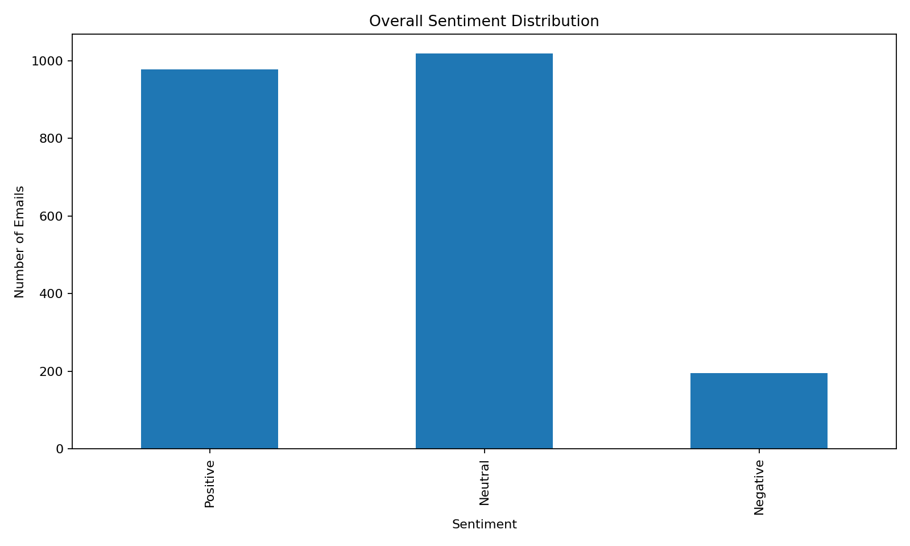
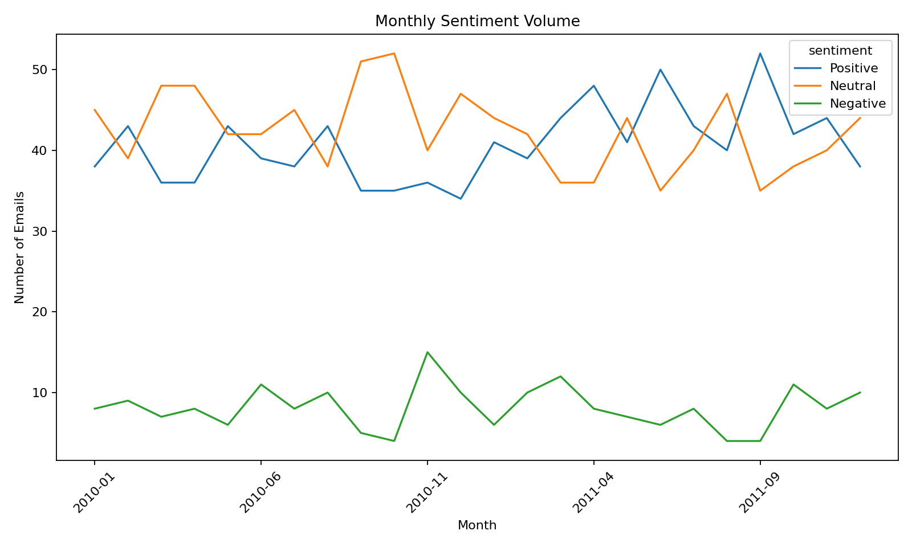
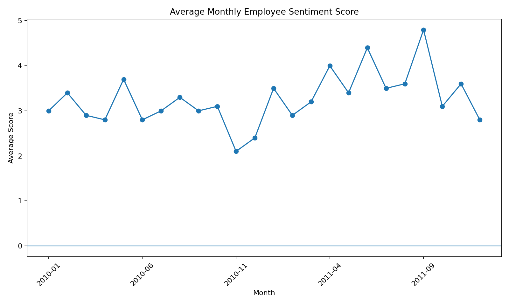
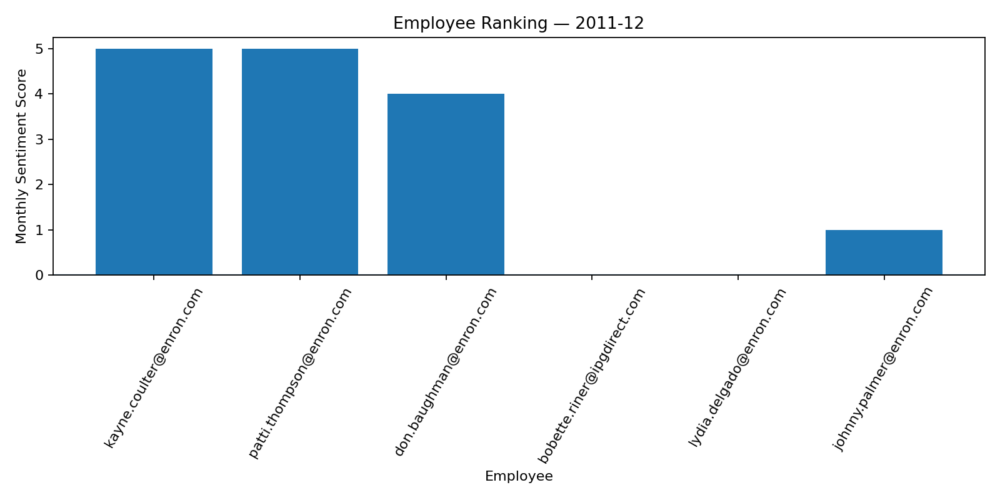
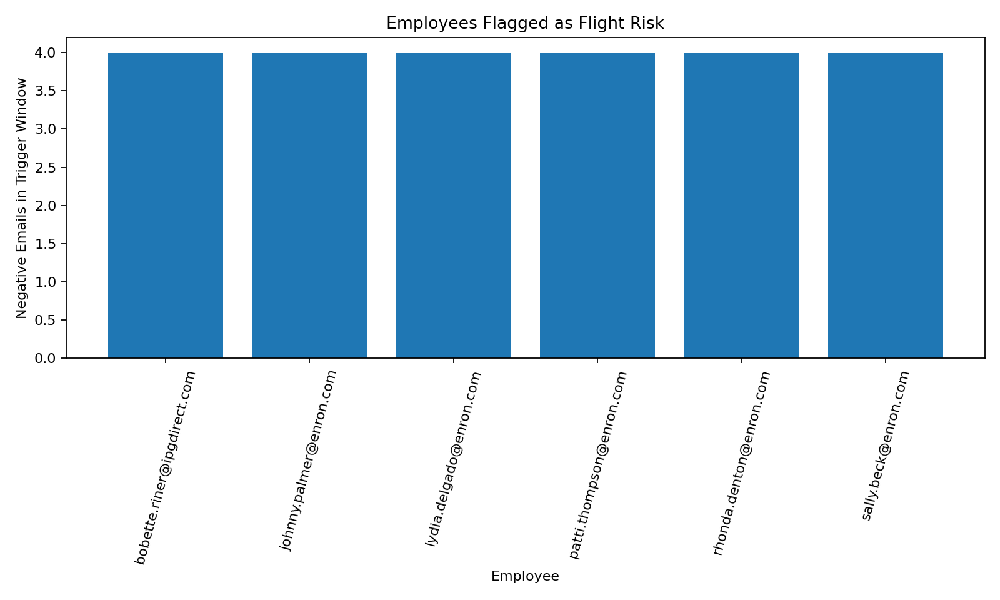
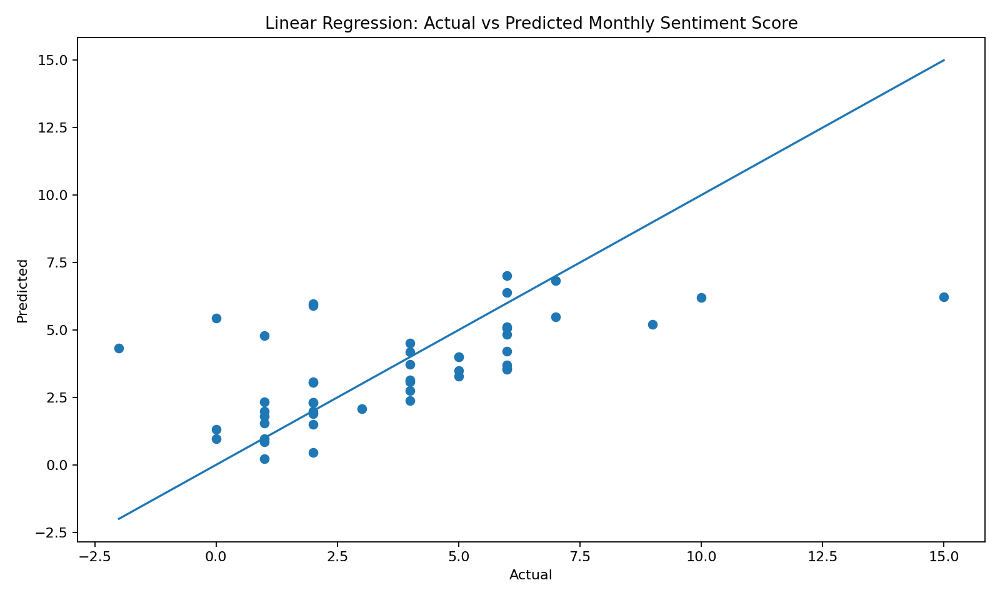

# Employee Sentiment Analysis — Final Report

## 1. Executive Summary
The supplied dataset contains **2,191 employee messages** from **10 senders** over **24 months**, from 2010-01-01 to 2011-12-31.

The analysis labels messages, performs EDA, calculates monthly employee scores, creates rankings, identifies rolling 30-day flight risks, and evaluates a linear regression model.

## 2. Dataset Quality
| Measure | Result |
|---|---:|
| Records | 2,191 |
| Columns | 4 |
| Senders | 10 |
| Date range | 2010-01-01 – 2011-12-31 |
| Missing values | 0 |
| Duplicate rows | 0 |

Fields: `Subject`, `body`, `date`, `from`.

## 3. Sentiment Labeling
TextBlob polarity is calculated on `Subject + body`.

- Positive: polarity > 0.10
- Neutral: -0.10 to 0.10
- Negative: polarity < -0.10

A small explicit correction list handles a few short conversational expressions where generic polarity is misleading.

| Sentiment | Messages | Share |
|---|---:|---:|
| Positive | 978 | 44.6% |
| Neutral | 1,018 | 46.5% |
| Negative | 195 | 8.9% |

## 4. EDA Findings
The dataset has no missing values and no duplicate rows. Neutral messages form the largest class under the selected threshold, while negative messages are the smallest.

The highest average monthly employee score occurs in **2011-09 (4.8)** and the lowest in **2010-11 (2.1)**.

## 5. Monthly Employee Score
Each message contributes +1, -1, or 0 according to its sentiment. Scores are summed separately by employee and calendar month, so every month starts from zero.

Full output: `output/monthly_scores.csv`.

## 6. Employee Ranking
For each month, the three highest scores form the positive ranking and the three lowest scores form the negative ranking. Alphabetical order resolves ties.

### Latest month: 2011-12

**Top 3 Positive**
1. **kayne.coulter@enron.com** — 5
2. **patti.thompson@enron.com** — 5
3. **don.baughman@enron.com** — 4

**Top 3 Negative**
1. **bobette.riner@ipgdirect.com** — 0
2. **lydia.delgado@enron.com** — 0
3. **johnny.palmer@enron.com** — 1

Full monthly rankings: `output/employee_rankings.csv`.

## 7. Flight Risk
The assessment defines a flight risk as an employee with **4 or more negative emails within any rolling 30-day period**, regardless of month boundaries.

**6 employees were flagged.**

| Employee | Trigger window | Negative emails |
|---|---|---:|
| bobette.riner@ipgdirect.com | 2010-10-19 – 2010-11-17 | 4 |
| johnny.palmer@enron.com | 2011-01-28 – 2011-02-26 | 4 |
| lydia.delgado@enron.com | 2011-11-21 – 2011-12-20 | 4 |
| patti.thompson@enron.com | 2011-03-14 – 2011-04-12 | 4 |
| rhonda.denton@enron.com | 2010-12-03 – 2011-01-01 | 4 |
| sally.beck@enron.com | 2010-06-08 – 2010-07-07 | 4 |

## 8. Linear Regression
Target: monthly sentiment score.

Features:
- Monthly message count
- Average word count
- Average character count

These features avoid directly feeding positive/negative counts into the target.

Model: **scikit-learn LinearRegression**

| Metric | Result |
|---|---:|
| MAE | 1.6343 |
| RMSE | 2.3904 |
| R² | 0.3673 |

The model explains part of the variation in monthly sentiment scores, but substantial variation remains unexplained. This is exploratory association analysis, not a causal model.

## 9. Key Findings
- 2,191 messages from 10 senders were analyzed.
- Neutral sentiment is the largest class.
- Negative messages represent 8.9% of the dataset.
- 6 employees meet the rolling 30-day flight-risk rule under the generated labels.
- The strongest and weakest average monthly employee scores occur in 2011-09 and 2010-11, respectively.
- The regression model has R² = 0.3673; message frequency and text-length features alone do not fully explain sentiment score variation.

## 10. Reproducibility
Create a virtual environment, install `requirements.txt`, launch Jupyter, and run `Employee_Sentiment_Analysis.ipynb` from top to bottom.

## 11. Limitations and Future Improvements
TextBlob is a lightweight sentiment baseline, not a domain-specific transformer/LLM. Quoted/forwarded text, sarcasm, and business-specific language can affect classification.

Possible improvements:
- human-validated labels
- a domain-adapted transformer
- quoted/forwarded-text removal
- time-series validation
- richer employee behavior features
- model comparison

